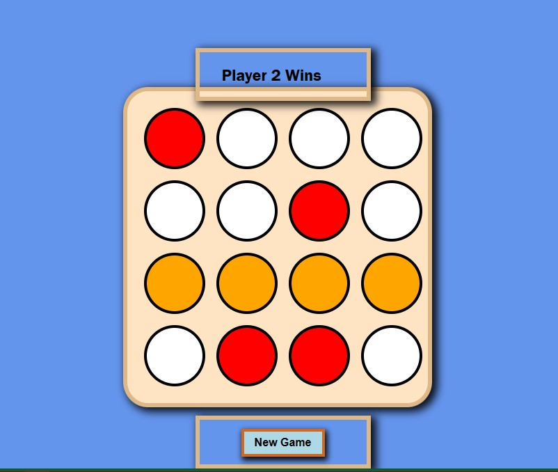

--React Tic-TacT-oe Game--

An interactive Tic-Tac-Toe game using React, where two players can take turns marking the board with 'X' and 'O.' The game features dynamic player switching, real-time result updates, and a computer AI opponent that suggests moves when needed

Available online here:
https://shiny-eclair-ddfa3e.netlify.app/
